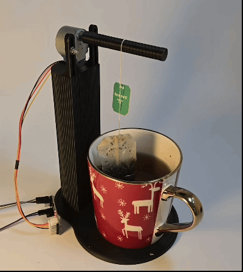

# Tee Dunker

An automated golf tee dunking machine built with an ESP32 and a small stepper motor. It dips golf tees into liquid on a timer — set it, plug it in, walk away.



## What It Does

The motor turns back and forth in a loop, dunking a tee holder into a container. After a configurable duration, it does a final turn and stops. The whole procedure starts automatically when you plug it in — no phone or computer needed.

If you want more control, there's a desktop app that lets you tweak settings, monitor status, and flash new firmware over USB.

## Hardware

- **ESP32** microcontroller
- **28BYJ-48** stepper motor + **ULN2003** driver board
- **3D-printed housing** — designed to hold the motor, tee holder, and container together

### 3D Printed Parts

The housing is designed in CAD and available as a `.3mf` file:

- [**MakerWorld**](https://makerworld.com/en/models/2601612-tea-dunker#profileId-2870693)
- [**Printables**](https://www.printables.com/model/1658917-tea-dunker)

A backup of the `.3mf` file is included in this repo (`tea_dunker_veryos.3mf`), but the latest version will always be on MakerWorld/Printables.

## Settings

You can configure these parameters (stored on the ESP32, persistent across reboots):

| Setting | What it does | Default |
|---------|-------------|---------|
| Loop turns | How many turns per back-and-forth cycle | 0.5 |
| Final turns | Extra turns at the end before stopping | 2 |
| Duration | Minimum run time in minutes | 5 |
| RPM | Motor speed | 12.0 |

WiFi, server connection, and motor pin assignments are also configurable.

## Software Stack

| Part | Tech |
|------|------|
| ESP32 firmware | Arduino (C++) |
| Desktop server | Deno (JavaScript) |
| Desktop GUI | Vue 3 |
| Communication | WebSockets |

## Getting Started

1. Flash the ESP32 firmware from `esp32/stepper_control/stepper_control.ino`
2. Print the housing and assemble the hardware
3. Plug it in — it starts automatically

For the desktop app (optional):
```bash
deno task run
```

## License

See [LICENSE](LICENSE) file for details.
